# 🚀 Computation Search - Motor de Busca Inteligente

Este projeto é um motor de busca avançado que combina a robustez e velocidade do **Elasticsearch 8.x** com a inteligência cognitiva de **LLMs locais (Ollama - Llama 3.1)** e processamento de imagem via **OCR especializado (LatexOCR)** para indexar, identificar, corrigir e priorizar fórmulas matemáticas e conteúdos de computação científica.

---

## 🏗️ Arquitetura do Sistema

O fluxo de busca do sistema é orquestrado de forma assíncrona pelo Spring Boot para manter tempos de resposta baixos, minimizando gargalos de rede e processamento de LLM:

```mermaid
sequenceDiagram
    autonumber
    actor User as Usuário / Cliente
    participant FE as React Frontend
    participant BE as Spring Boot Backend
    participant LLM as Ollama (Llama 3.1)
    participant ES as Elasticsearch 8.x
    participant OCR as Python LatexOCR

    %% Fluxo de Busca por Texto
    Note over User, FE: 🔍 Fluxo de Busca por Texto
    User->>FE: Insere consulta (Debounced / Submit)
    FE->>BE: GET /search?query={query}&page={page}
    rect rgb(15, 23, 42)
        Note right of BE: Spring Boot Orchestrator
        BE->>BE: Valida se é fórmula (isLikelyFormula)
        alt É fórmula matemática
            BE->>LLM: Identifica Nome da Fórmula (Assíncrono com Timeout)
            LLM-->>BE: Retorna nome identificado (ex: "Schrödinger")
        else Não é fórmula
            Note right of BE: Ignora LLM para otimizar latência
        end
        BE->>ES: Executa busca com Boosts, Fuzziness, Collapse e Suggester
        ES-->>BE: Retorna Hits, Highlights, Collapsed URLs & Sugestão Spellcheck
    end
    BE-->>FE: Retorna SearchResponse (Resultados + didYouMean)
    FE-->>User: Renderiza Resultados formatados com KaTeX

    %% Fluxo de Busca por Imagem
    Note over User, FE: 📷 Fluxo de Busca por Imagem (OCR)
    User->>FE: Envia Imagem contendo fórmula
    FE->>BE: POST /search/image (Multipart)
    BE->>OCR: POST /extract-latex (FastAPI)
    OCR-->>BE: Retorna string de fórmula LaTeX extraída
    BE->>BE: Executa pipeline de Busca por Texto (passos 4 em diante)
    BE-->>FE: Retorna Resultados da imagem processada
```



---

## 🎯 Engenharia de Relevância & Mecanismo de Busca (Elasticsearch)

Para fornecer resultados precisos e dar prioridade a documentos altamente relacionados ao contexto científico pesquisado, o motor utiliza uma consulta booleana combinada (`bool query`) com pesos dinâmicos ajustados (`boosting`):

### 1. Pesos Dinâmicos de Relevância (Boosting)
A relevância (`_score`) de cada documento é calculada com base na significância do termo no campo correspondente:
*   **Correspondência Exata no Título (`boost(100.0f)`)**: Utiliza `matchPhrase` no campo `title`. Títulos de artigos que contenham exatamente a frase pesquisada (com flexibilidade controlada de até 2 posições por meio de `slop(2)`) sobem para o topo dos resultados.
*   **Correspondência no Conteúdo (`boost(50.0f)`)**: Utiliza `matchPhrase` no campo `content` com `slop(3)` para garantir proximidade contextual nas frases explicativas.
*   **Reconhecimento Cognitivo de Fórmulas (`boost(150.0f)`)**: Se a busca conter símbolos matemáticos ou notações LaTeX, o sistema extrai o nome conceitual dessa fórmula usando o LLM. Se esse nome identificado (ex: *"Schrödinger"*) coincidir perfeitamente com o título do documento, é aplicado o maior boost do sistema, garantindo que o artigo enciclopédico principal da fórmula venha em primeiro lugar.
*   **Correspondência de Palavras-Chave Geral (`boost(1.0f)`)**: Um multi-match padrão que serve como base para garantir que documentos contendo as palavras soltas também sejam pontuados.

### 2. Tratamento de Frases Literais (Quoted Searches)
Se o usuário encapsular a pesquisa em aspas duplas (ex: `"/etc/passwd"` ou `"Schrödinger's cat"`), o sistema detecta esse comportamento e ativa um filtro estrito configurando `minimumShouldMatch("100%")`. Isso transforma as condições opcionais (`should`) em condições obrigatórias (`must`), garantindo que apenas páginas contendo a frase literal exata sejam exibidas.

---

## 🔍 Tolerância a Erros & Sistema de Sugestões

A inteligência de busca inclui suporte nativo a erros de digitação e auto-completar inteligente:

### 1. Fuzziness (Busca Difusa baseada em Levenshtein)
Configurado diretamente na busca geral com `.fuzziness("AUTO")`. O Elasticsearch calcula a distância de edição entre a palavra buscada e as indexadas:
*   Para palavras de **0 a 2 caracteres**: Exige correspondência exata.
*   Para palavras de **3 a 5 caracteres**: Permite **1 alteração** (inserção, deleção ou substituição de letra).
*   Para palavras de **mais de 5 caracteres**: Permite até **2 alterações**.

Isso garante que ao digitar `"Schrödiger"` (faltando a letra `"n"`), os resultados para `"Schrödinger"` ainda sejam recuperados imediatamente no painel de resultados do usuário, em vez de retornar uma lista vazia.

### 2. Auto-Complete (Sugestões de Escrita ao Digitar)
No momento em que o usuário digita no input, um evento *debounced* de **150ms** no frontend dispara uma requisição para a rota `/v1/suggest`. O backend utiliza a query `matchPhrasePrefix` no campo `title`:
```java
Query esQuery = Query.of(q -> q
    .matchPhrasePrefix(mpp -> mpp
        .field("title")
        .query(query)
    )
);
```
Isso varre os títulos do banco de dados trazendo termos em tempo real que começam com o prefixo digitado pelo usuário, agilizando a navegação.

### 3. Sugestão Spellcheck ("Você quis dizer")
Caso a consulta original possua um erro ortográfico grosseiro ou sutil, o Elasticsearch ativa o analisador de termos (`term suggester`) no campo `content`. 
O backend processa a sugestão retornada:
```java
.suggest(su -> su
    .text(processedQuery)
    .suggesters("spellcheck", sg -> sg
        .term(t -> t
            .field("content")
        )
    )
)
```
Se houver uma correção candidata disponível com maior relevância, o backend reconstrói a query e a envia como o parâmetro `didYouMean` na resposta. O frontend renderiza este atalho ortográfico como um banner moderno de aviso no topo da listagem para redirecionamento rápido de busca.

---

## 🚀 Otimizações de Performance e Formatação de Dados

### 1. Eliminação de Resultados Duplicados (Field Collapse)
Um artigo ou site pode ter várias referências ou seções salvas. Para evitar que os primeiros resultados da pesquisa pertençam ao mesmo domínio de URL, aplicamos o agrupamento/desmembramento vertical via **Field Collapse**:
```java
.collapse(c -> c.field("url.keyword"))
```
Dessa forma, o Elasticsearch exibe apenas o documento mais relevante de cada URL única, maximizando a diversidade de conteúdo da listagem.

### 2. Formatação Segura de LaTeX no Frontend
A renderização de expressões matemáticas no navegador é crítica. O backend executa um sanitizador avançado antes de enviar o resumo para o React:
*   Varre marcas especiais de equações e converte em delimitadores padrão do KaTeX (`$`).
*   **Balanceamento de delimitadores**: Se houver um número ímpar de caracteres `$`, ele automaticamente adiciona um delimitador final para evitar quebra de renderização de tags no frontend.
*   **Sanitização de Braces**: Garante a paridade de chaves matemáticas `{}` dentro das equações, evitando erros de sintaxe no parser do KaTeX no cliente.

---

## 🛠️ Configuração do Ambiente Local

### Pré-requisitos
*   **Java 21** e **Maven**
*   **Node.js 18+** & **npm**
*   **Python 3.12+** (para o microsserviço de OCR)
*   **Elasticsearch 8.x** rodando na máquina ou via docker.
*   **Ollama** executando os modelos locais `llama3.1:8b` (para classificação) e `llava` (para multimodalidade).

### 1. Executando o Backend (Java Spring Boot)
Configure as credenciais e host do Elasticsearch no arquivo `.env` localizado na raiz do projeto e inicie a aplicação:
```bash
mvn spring-boot:run
```

### 2. Executando o Serviço de OCR (Python FastAPI)
Navegue até a pasta de scripts, instale as dependências e inicie o servidor:
```bash
cd pythonScript
source venv/bin/activate
pip install -r requirements.txt
python ocr_service.py
```
O serviço FastAPI de extração de LaTeX por OCR rodará na porta **8001**.

### 3. Executando o Frontend (React + Vite)
Instale os pacotes e inicialize o servidor de desenvolvimento:
```bash
cd front-end/ComputationSearch
npm install
npm run dev
```
Acesse a aplicação pela porta padrão: `http://localhost:5173`.
